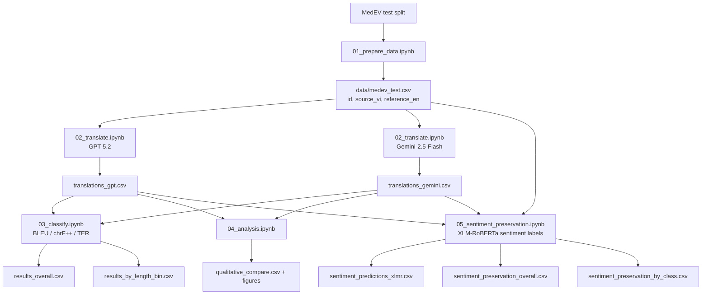

# MedEV Translation and Sentiment Preservation: GPT vs Gemini

This project evaluates Vietnamese -> English medical translation on MedEV with two complementary views:
- Machine translation quality (BLEU, chrF++, TER)
- Sentiment preservation (XLM-RoBERTa labels compared to source sentiment)

Compared translation models:
- GPT (`openai/gpt-5.2`)
- Gemini (`google/gemini-2.5-flash`)

Sentiment labeling model:
- XLM-RoBERTa (`cardiffnlp/twitter-xlm-roberta-base-sentiment`)

---

## Project Overview

| Item | Detail |
|---|---|
| Task | Vietnamese -> English medical translation + sentiment preservation |
| Dataset | MedEV (`nhuvo/MedEV`) |
| Data source | Hugging Face Datasets |
| Rows used in final evaluation | 8,959 paired rows |
| Translation models compared | GPT-5.2 vs Gemini-2.5-Flash |
| Sentiment model | XLM-RoBERTa multilingual sentiment |
| Main outputs | MT metrics, sentence-level comparison, sentiment preservation tables |

---

## MedEV Notes

In this environment, MedEV is loaded as a single `text` column for each split.

In `01_prepare_data.ipynb`, the pairing rule is:
- First half of `test` rows: English reference
- Second half of `test` rows: Vietnamese source
- Pair by aligned index to create:
  - `source_vi`
  - `reference_en`

Then export to `data/medev_test.csv` with columns:
- `id`
- `source_vi`
- `reference_en`

---

## Pipeline

```text
01_prepare_data.ipynb
  -> data/medev_test.csv

02_translate.ipynb
  -> outputs_medev/translations_gpt.csv
  -> outputs_medev/translations_gemini.csv

03_classify.ipynb
  -> outputs_medev/results_overall.csv
  -> outputs_medev/results_by_length_bin.csv

04_analysis.ipynb
  -> outputs_medev/qualitative_compare.csv
  -> outputs_medev/figures/

05_sentiment_preservation.ipynb
  -> outputs_medev/sentiment_predictions_xlmr.csv
  -> outputs_medev/sentiment_preservation_overall.csv
  -> outputs_medev/sentiment_preservation_by_class.csv
```

---

## Files and Folders

```text
Sentiment-Comparison/
|-- 01_prepare_data.ipynb
|-- 02_translate.ipynb
|-- 03_classify.ipynb
|-- 04_analysis.ipynb
|-- 05_sentiment_preservation.ipynb
|-- data/
|   `-- medev_test.csv
|-- outputs_medev/
|   |-- translations_gpt.csv
|   |-- translations_gemini.csv
|   |-- results_overall.csv
|   |-- results_by_length_bin.csv
|   |-- qualitative_compare.csv
|   |-- sentiment_predictions_xlmr.csv
|   |-- sentiment_preservation_overall.csv
|   |-- sentiment_preservation_by_class.csv
|   `-- figures/
`-- README.md
```

---

## Setup

### 1) Python packages

Install required packages (if missing):

```bash
pip install datasets openai sacrebleu pandas numpy matplotlib transformers torch
```

### 2) API key

Set OpenRouter API key in environment:

```bash
OPENROUTER_API_KEY=your_key_here
```

(You can also store it in `.env` if your environment loader is configured.)

---

## Run Order

1. Run `01_prepare_data.ipynb`
2. Run `02_translate.ipynb`
3. Run `03_classify.ipynb`
4. Run `04_analysis.ipynb`
5. Run `05_sentiment_preservation.ipynb`

---

## Research Overview Diagram



### Beginner-Friendly Explanation of the Diagram

If you are new to AI, think of this pipeline as a 5-step checking process:
1. Prepare one clean test sheet (`source_vi` and `reference_en`).
2. Ask two translators (GPT and Gemini) to translate the same Vietnamese sentences.
3. Score translation quality (BLEU/chrF++/TER).
4. Compare sentence-by-sentence outputs to see who writes better in practice.
5. Use XLM-RoBERTa as an "emotion checker" to see whether translated sentences keep the same sentiment as the source.

Simple example:
- Source sentence sentiment = `negative`.
- If translated sentence sentiment is also `negative`, that sentence is counted as preserved.
- If it changes to `neutral` or `positive`, that sentence is counted as not preserved.

---

## Results by Research Questions

All values below are from current files in `outputs_medev/`.

### RQ1. How does the sentiment preservation performance of ChatGPT and Gemini differ for Vietnamese-to-English translation?

Preservation is measured as label agreement with `source_vi` sentiment (labeled by XLM-RoBERTa).

| Model | Compared Rows | Matched Rows | Preservation Accuracy |
|---|---:|---:|---:|
| GPT-5.2 | 8,959 | 7,649 | 85.378% |
| Gemini-2.5-Flash | 8,959 | 7,674 | 85.657% |

Conclusion:
- Gemini is slightly higher than GPT by **+0.279 percentage points**.

Easy explanation:
- RQ1 asks: "Out of all translated sentences, model nao giu duoc cam xuc goc nhieu hon?"
- O day, Gemini nhinh hon GPT mot it, nhung khoang cach kha nho.

Simple example:
- Gia su co 1,000 cau.
- GPT giu dung sentiment cho 854 cau, Gemini giu dung cho 857 cau.
- Nghia la Gemini hon 3 cau tren 1,000 cau (cung mot xu huong nhu bang ket qua).

### RQ2. Does preservation accuracy differ across Positive, Neutral, and Negative sentiment classes?

| Class | Source Count | GPT Accuracy | Gemini Accuracy | Delta (Gemini - GPT, pp) |
|---|---:|---:|---:|---:|
| negative | 1,352 | 81.657% | 82.618% | +0.962 |
| neutral | 7,408 | 86.650% | 86.785% | +0.135 |
| positive | 199 | 63.317% | 64.322% | +1.005 |
| macro_avg | 8,959 | 77.208% | 77.908% | +0.701 |
| overall_weighted | 8,959 | 85.378% | 85.657% | +0.279 |

Interpretation:
- Gemini is better in all three sentiment classes.
- Positive class is hardest for both models.
- Because class distribution is imbalanced, report both `macro_avg` and `overall_weighted`.

Easy explanation:
- RQ2 khong nhin chung tat ca cau mot luc, ma tach theo 3 nhom cam xuc: `negative`, `neutral`, `positive`.
- Cach nay giup thay model manh/yeu o tung nhom cam xuc, khong bi "che" boi nhom neutral qua lon.

Simple example:
- Trong nhom `positive`, GPT dung 63.317% va Gemini dung 64.322%.
- Nghia la voi 100 cau positive, GPT dung khoang 63 cau, Gemini dung khoang 64 cau.

### RQ3. Is the sentiment preservation gap statistically significant?

We use McNemar's test on paired correctness (correct = model sentiment equals `source_vi` sentiment).

| Paired outcome | Count |
|---|---:|
| Both correct | 7,370 |
| GPT only correct | 279 |
| Gemini only correct | 304 |
| Both wrong | 1,006 |

Test result:
- McNemar with continuity correction: $\chi^2 = 0.988$, $p = 0.320$.
- McNemar without continuity correction: $\chi^2 = 1.072$, $p = 0.300$.

Conclusion:
- At $\alpha = 0.05$, the sentiment preservation difference is **not statistically significant**.
- Gemini is still directionally better, but the margin is small.

Easy explanation:
- RQ3 kiem tra xem chenhlech nho o RQ1 co "that su chac chan" hay co the chi la dao dong ngau nhien.
- Vi `p > 0.05`, ta khong the ket luan rang Gemini vuot GPT mot cach co y nghia thong ke cho sentiment preservation.

Simple example:
- Giong nhu hai ban lam bai kiem tra va hon nhau 0.2 diem.
- Diem cao hon chua chac da "tot hon that su" neu sai so do luong van lon.

### RQ4. Where do the two models differ most in practice?

| Indicator | GPT-5.2 | Gemini-2.5-Flash |
|---|---:|---:|
| Overall sentiment preservation | 85.378% | 85.657% |
| Unique correct cases (while other model is wrong) | 279 | 304 |
| Sentence-level BLEU wins | 2,882 | 5,161 |

Interpretation:
- For sentiment preservation, Gemini has a small but consistent edge.
- For translation quality (BLEU winner count), Gemini has a larger advantage.
- The hardest sentiment class is `positive` for both models, and source labels are strongly imbalanced (`neutral` dominates).

Easy explanation:
- RQ4 tra loi theo goc nhin ung dung: "Neu dem vao viec thuc te thi khac nhau nhu the nao?"
- Ve giu sentiment, hai model kha gan nhau; ve chat luong cau dich, Gemini vuot ro hon.

Simple example:
- Neu muc tieu cua ban la giu cam xuc cho chatbot hoac phan tich y kien, ca hai deu dung, Gemini nhinh hon nhe.
- Neu muc tieu cua ban la cau dich tu nhien va sat nghia hon (theo BLEU), Gemini co loi the ro rang hon.

---

## Complementary MT Findings (Quality)

### Overall MT metrics

| Model | BLEU (higher) | chrF++ (higher) | TER (lower) |
|---|---:|---:|---:|
| GPT-5.2 | 33.383 | 59.609 | 59.983 |
| Gemini-2.5-Flash | 38.274 | 61.808 | 54.977 |

### Sentence-level winner count (BLEU)

| Winner | Count | Ratio |
|---|---:|---:|
| Gemini | 5,161 | 57.61% |
| GPT | 2,882 | 32.17% |
| Tie | 916 | 10.22% |

---

## Important Runtime Notes

### API credits and 402 errors

During translation, OpenRouter may return `402` if remaining credits are insufficient.

Current translation notebook supports:
- Resume from existing CSV
- Retry on previous error rows
- Adaptive lower `max_tokens` on 402
- Targeted retry for specific failed IDs

If 402 remains:
- Add credits, then rerun translation cells
- Or lower token budget further for rescue retries

### Evaluation scope

Both MT and sentiment evaluations run on successfully translated rows (non-`ERROR`) to avoid distortion from API failures.

### Sentiment caveat

Sentiment labels are generated by a general multilingual XLM-RoBERTa model, so medical-domain phrasing may still introduce label noise.

---

## Citation (MedEV)

If you use MedEV, please cite:

```bibtex
@inproceedings{vo-etal-2024-improving,
    title = "Improving {V}ietnamese-{E}nglish Medical Machine Translation",
    author = "Vo, Nhu and Nguyen, Dat Quoc and Le, Dung D. and Piccardi, Massimo and Buntine, Wray",
    booktitle = "Proceedings of the 2024 Joint International Conference on Computational Linguistics, Language Resources and Evaluation (LREC-COLING 2024)",
    year = "2024",
    pages = "8955--8962",
    url = "https://aclanthology.org/2024.lrec-main.784/"
}
```

---

## Status

This repository now supports both:
- MedEV machine translation quality comparison
- Sentiment preservation analysis with XLM-RoBERTa

For final thesis reporting, rerun all notebooks in order and freeze the generated CSV files and figures from `outputs_medev/`.
