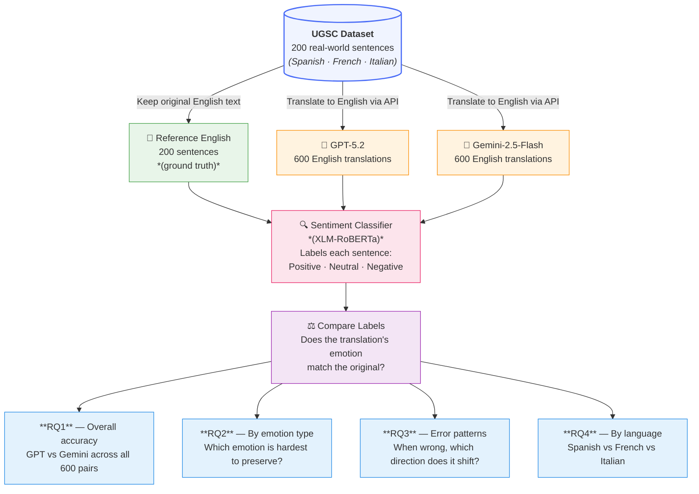

# Sentiment Preservation in Multilingual Machine Translation: GPT vs Gemini

This dissertation project asks a simple question: **when an AI translator converts a sentence from Spanish, French, or Italian into English, does it keep the feeling of the original sentence?**

For example, if a Spanish sentence sounds angry, does the English translation also sound angry — or does it come out sounding neutral or even happy? We tested two of the most popular AI translation tools (GPT-5.2 and Gemini-2.5-Flash) on 200 real-world sentences across three languages and measured how often each one got the feeling right.

---

## Project Overview

| Item | Detail |
|---|---|
| **What we're studying** | Do AI translators keep the emotion (positive / neutral / negative) of the original sentence? |
| **Tools compared** | GPT-5.2 (by OpenAI) vs Gemini-2.5-Flash (by Google) |
| **Source languages** | Spanish · French · Italian |
| **Target language** | English |
| **How we measure it** | A separate AI model reads each translated sentence and labels it as Positive, Neutral, or Negative. We then check if that label matches the original. |
| **Dataset** | 200 sentences × 3 languages = **600 translation pairs** |
| **Emotion categories** | Positive (happy/good) · Neutral (flat/factual) · Negative (sad/angry/bad) |

---

## Research Overview Diagram



**Reading the diagram:**
1. We start with **200 real sentences** in Spanish, French, and Italian.
2. The original English version is kept as the **reference** (the "correct answer").
3. Both AI tools (**GPT-5.2** and **Gemini-2.5-Flash**) translate each sentence into English — giving us 600 translations each.
4. A **sentiment classifier** then reads every sentence (reference + both translations) and stamps it Positive, Neutral, or Negative.
5. We **compare** the translation's stamp to the reference stamp — if they match, the AI preserved the feeling correctly.
6. The results answer our **4 research questions**.

---

## Pipeline

```
01_prepare_data.ipynb   →   data/sentences.csv              (200 rows)
02_translate.ipynb      →   outputs/translations_gpt.csv    (600 rows)
                            outputs/translations_gemini.csv  (600 rows)
03_classify.ipynb       →   outputs/classifications.csv     (1800 rows — all texts labelled)
04_analysis.ipynb       →   outputs/summary_results.csv
                            outputs/figures/
```

---

## Research Questions & Results

### RQ1 — Which AI translator is better at keeping the right feeling overall?

> *Which model better preserves the original sentiment label across all language pairs?*

**How we measured it:** After each AI translated a sentence into English, a third-party emotion detector read it and decided: is this Positive, Neutral, or Negative? We then compared that result to the original sentence's emotion label. If they matched — the translator did its job correctly. We did this for all 600 sentence pairs.

| Model | Got it right | Accuracy | Difference |
|---|---|---|---|
| GPT-5.2 | 477 out of 600 | 79.50% | — |
| Gemini-2.5-Flash | 484 out of 600 | **80.67%** | +1.17% better |

**What this means:** Gemini got 7 more sentences right than GPT out of 600. That's a small gap, but what makes it meaningful is that Gemini consistently wins across languages and emotion types — it's not just a lucky fluke. Think of it like a student who scores 1 mark higher on every section of an exam versus one who randomly scores higher on one section.

> **Chart:** `outputs/figures/rq1_overall.png`

---

### RQ2 — Do both AIs handle all three emotions equally well?

> *Does preservation accuracy differ across Positive, Neutral, and Negative sentiment classes?*

**How we measured it:** We split all 600 sentences by their original emotion label and measured accuracy separately for each group.

| Emotion | How many sentences | GPT got right | Gemini got right | Difference | Winner |
|---|---|---|---|---|---|
| Positive 😊 | 233 (38.8%) | 86.43% | 86.43% | 0% | Tie |
| Neutral 😐 | 105 (17.5%) | 63.33% | 65.83% | +2.50% | **Gemini** |
| Negative 😠 | 195 (32.5%) | 80.18% | 81.98% | +1.80% | **Gemini** |

**What this means:**

- **Positive sentences are the easiest.** When a sentence is clearly happy or optimistic, both AIs almost always get the translation right. Happy words like "wonderful", "I love", "great news" tend to translate the same way in every language, so the feeling is easy to carry over.
- **Neutral sentences are the hardest — by far.** Both AIs score roughly 20% lower on neutral sentences than positive ones. Why? Neutral sentences are often flat and factual (e.g., "The meeting is at 3pm"). When translated, the AI sometimes picks word choices that sound slightly warm or slightly cold, accidentally tipping the emotion one way. With no clear emotional anchor, there's more room to drift.
- **Negative sentences are handled better than you'd expect.** Words like "terrible", "I hate", "disaster" are strongly emotional — those feelings come through clearly even after translation.
- Gemini's biggest edge over GPT is on **neutral sentences** (+2.50%), meaning it's better at keeping "flat" sentences flat.

> **Chart:** `outputs/figures/rq2_by_class.png`

---

### RQ3 — When an AI gets the feeling wrong, which direction does it go?

> *When sentiment is not preserved, what types of shifts occur and are they systematic?*

**How we measured it:** We matched up each sentence's original emotion label, GPT's translation label, and Gemini's translation label into 533 triplets. Every time a translation's emotion label didn't match the original, we recorded which way it shifted (e.g., was originally Negative, came out as Neutral).

#### How often does each AI get it wrong?

| Model | Mistakes made | Out of | Error rate | Correct rate |
|---|---|---|---|---|
| GPT-5.2 | 56 | 533 | 10.51% | 89.49% |
| Gemini-2.5-Flash | 49 | 533 | **9.19%** | 90.81% |

Gemini makes **7 fewer mistakes**, which is about 12.5% fewer errors than GPT.

#### When GPT gets it wrong, what happens? (56 mistakes total)

| What it was → What AI said | How many times | Share | Plain English |
|---|---|---|---|
| Neutral → Positive | 21 | 37.5% | A flat sentence came out sounding happy |
| Negative → Neutral | 9 | 16.1% | An angry/sad sentence came out sounding flat |
| Neutral → Negative | 7 | 12.5% | A flat sentence came out sounding bad |
| Negative → Positive | 7 | 12.5% | An angry sentence came out sounding happy ⚠️ |
| Positive → Negative | 5 | 8.9% | A happy sentence came out sounding angry ⚠️ |
| Positive → Neutral | 5 | 8.9% | A happy sentence came out sounding flat |

#### When Gemini gets it wrong, what happens? (49 mistakes total)

| What it was → What AI said | How many times | Share | Plain English |
|---|---|---|---|
| Neutral → Positive | 20 | 40.8% | A flat sentence came out sounding happy |
| Negative → Neutral | 7 | 14.3% | An angry/sad sentence came out sounding flat |
| Neutral → Negative | 6 | 12.2% | A flat sentence came out sounding bad |
| Negative → Positive | 6 | 12.2% | An angry sentence came out sounding happy ⚠️ |
| Positive → Negative | 5 | 10.2% | A happy sentence came out sounding angry ⚠️ |
| Positive → Neutral | 5 | 10.2% | A happy sentence came out sounding flat |

**What this means:**

- **The #1 mistake for both AIs is turning a neutral sentence into a positive one.** This accounts for ~38–41% of all errors. The reason: AI translators are trained on huge amounts of internet text, which tends to be written in an upbeat, friendly tone. So when a sentence has no strong emotion, the AI's "default mood" slightly pulls it toward positive.
- **Complete reversals (⚠️ rows) are the most dangerous errors** — turning happy into angry or angry into happy completely flips the meaning. These make up about 20% of all mistakes for both models. Imagine a customer complaint being translated to sound like a compliment — that's the kind of damage these shifts can cause.
- **Both AIs make the same types of mistakes.** The pattern is nearly identical between GPT and Gemini. Gemini is just a little better at avoiding all of them, rather than being better at one specific type.

> **Charts:** `outputs/figures/rq3_shift_types.png` · `outputs/figures/rq3_confusion_matrices.png`

---

### RQ4 — Does the source language affect how well the AI preserves emotion?

> *Does sentiment preservation vary across Spanish, French, and Italian?*

**How we measured it:** The 600 pairs are split equally — 200 sentences per language. We measured accuracy separately for each language.

| Language | GPT got right | GPT score | Gemini got right | Gemini score | Difference | Winner |
|---|---|---|---|---|---|---|
| Spanish 🇪🇸 | 167 / 200 | 83.50% | 167 / 200 | 83.50% | 0% | Tie |
| French 🇫🇷 | 185 / 200 | 92.50% | 186 / 200 | 93.00% | +0.50% | **Gemini** |
| Italian 🇮🇹 | 181 / 200 | 90.50% | 187 / 200 | 93.50% | +3.00% | **Gemini** |

**What this means:**

- **French and Italian translations are significantly better than Spanish** — roughly 7–10% more accurate for both AIs. This is because French and Italian share a lot of emotional vocabulary with English (many words have the same Latin root), so emotional words translate more directly. For example, the French word "magnifique" and the English "magnificent" are obviously the same feeling. Spanish uses more indirect, idiomatic expressions for emotion that don't map as cleanly.
- **Spanish is the toughest language for both AIs, and they tie exactly at 83.5%.** Neither model has an edge here — both struggle equally with Spanish emotional phrasing.
- **Italian is where Gemini pulls the biggest lead (+3%).** Gemini translates Italian emotional sentences into English more faithfully than GPT. It's the most striking gap in the whole study.
- **French is nearly identical between the two models** (+0.5% for Gemini) — both handle French about as well as each other.

> **Chart:** `outputs/figures/rq4_by_language.png`

---

## Summary

| Dimension | Winner |
|---|---|
| Overall accuracy | **Gemini** (80.67% vs 79.50%) |
| Positive class | Tie |
| Neutral class | **Gemini** |
| Negative class | **Gemini** |
| Shift rate (lower = better) | **Gemini** (9.19% vs 10.51%) |
| Spanish | Tie |
| French | **Gemini** |
| Italian | **Gemini** |

**Gemini-2.5-Flash is the stronger sentiment-preserving model** across nearly all dimensions, with the most notable advantages on Neutral sentiment and Italian/French language pairs.

---

## File Structure

```
Thesis Quynh/
├── data/
│   └── sentences.csv                  # 200 source sentences (EN + ES/FR/IT)
├── outputs/
│   ├── translations_gpt.csv           # 600 GPT translations
│   ├── translations_gemini.csv        # 600 Gemini translations
│   ├── classifications.csv            # Sentiment labels for all texts
│   ├── summary_results.csv            # Aggregated accuracy table
│   └── figures/
│       ├── rq1_overall.png
│       ├── rq2_by_class.png
│       ├── rq3_confusion_matrices.png
│       ├── rq3_shift_types.png
│       └── rq4_by_language.png
├── 01_prepare_data.ipynb
├── 02_translate.ipynb
├── 03_classify.ipynb
└── 04_analysis.ipynb
```

---

## Environment

| Package | Version |
|---|---|
| Python | 3.10 (conda `py310`) |
| PyTorch | 2.6.0+cu118 |
| Transformers | latest |
| CUDA | 11.8 (RTX 3050) |
| protobuf | 3.20.3 |
| networkx | 3.2.1 |
