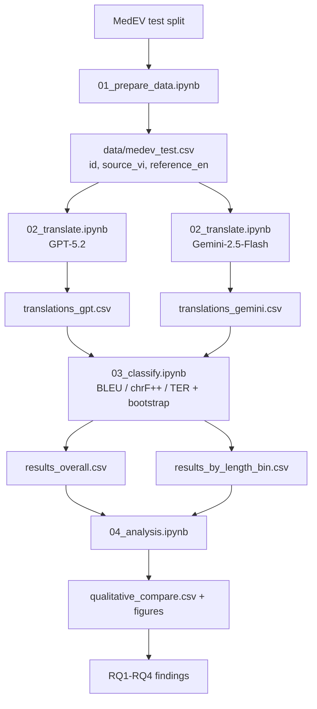

# Medical Machine Translation Evaluation: GPT vs Gemini on MedEV

This project evaluates Vietnamese -> English medical translation quality using the MedEV dataset.

The current pipeline compares two API models:
- GPT (`openai/gpt-5.2`)
- Gemini (`google/gemini-2.5-flash`)

Evaluation is done with standard MT metrics:
- BLEU (higher is better)
- chrF++ (higher is better)
- TER (lower is better)

---

## Project Overview

| Item | Detail |
|---|---|
| Task | Vietnamese -> English machine translation (medical domain) |
| Dataset | MedEV (`nhuvo/MedEV`) |
| Data source | Hugging Face Datasets |
| Test size used in pipeline | Around 8.9k paired sentences (after cleaning) |
| Models compared | GPT-5.2 vs Gemini-2.5-Flash |
| Main outputs | Overall metrics, length-bin metrics, qualitative comparison |

---

## MedEV Notes

MedEV on Hugging Face is currently loaded as a single `text` column per split in this environment.

In `01_prepare_data.ipynb`, the pairing rule is:
- First half of `test` rows: English reference
- Second half of `test` rows: Vietnamese source
- Pair by aligned index to create:
  - `source_vi`
  - `reference_en`

Then export to `data/medev_test.csv` with columns:
- `id`
- `source_vi`
- `reference_en`

---

## Pipeline

```text
01_prepare_data.ipynb
  -> data/medev_test.csv

02_translate.ipynb
  -> outputs_medev/translations_gpt.csv
  -> outputs_medev/translations_gemini.csv

03_classify.ipynb
  -> outputs_medev/results_overall.csv
  -> outputs_medev/results_by_length_bin.csv

04_analysis.ipynb
  -> outputs_medev/qualitative_compare.csv
  -> outputs_medev/figures/
```

---

## Files and Folders

```text
Sentiment-Comparison/
├── 01_prepare_data.ipynb
├── 02_translate.ipynb
├── 03_classify.ipynb
├── 04_analysis.ipynb
├── data/
│   └── medev_test.csv
├── outputs_medev/
│   ├── translations_gpt.csv
│   ├── translations_gemini.csv
│   ├── results_overall.csv
│   ├── results_by_length_bin.csv
│   ├── qualitative_compare.csv
│   └── figures/
└── README.md
```

---

## Setup

### 1) Python packages

Install required packages (if missing):

```bash
pip install datasets openai sacrebleu pandas numpy matplotlib
```

### 2) API key

Set OpenRouter API key in environment:

```bash
OPENROUTER_API_KEY=your_key_here
```

(You can also store it in `.env` if your environment loader is configured.)

---

## Run Order

1. Run `01_prepare_data.ipynb`
2. Run `02_translate.ipynb`
3. Run `03_classify.ipynb`
4. Run `04_analysis.ipynb`

---

## Research Overview Diagram



---

## Results by Research Questions (RQ1-RQ4)

All numbers below are from the current MedEV run outputs in `outputs_medev/`.

### RQ1. Model nao dich tong the tot hon tren MedEV?

Ket luan ngan gon: **Gemini-2.5-Flash tot hon GPT-5.2 tren ca 3 metric chinh**.

| Model | BLEU (higher better) | chrF++ (higher better) | TER (lower better) |
|---|---:|---:|---:|
| GPT-5.2 | 33.383 | 59.609 | 59.983 |
| Gemini-2.5-Flash | 38.274 | 61.808 | 54.977 |

Y nghia:
- Gemini +4.891 BLEU so voi GPT.
- Gemini +2.199 chrF++ so voi GPT.
- Gemini giam 5.006 TER (tot hon vi TER cang thap cang tot).

### RQ2. Xu huong nay co on dinh theo do dai cau khong?

Ket luan ngan gon: **co**. Gemini dan truoc GPT o tat ca cac bin do dai (1-10, 11-20, 21-35, 36+).

| Length bin | n | GPT BLEU | Gemini BLEU | GPT chrF++ | Gemini chrF++ | GPT TER | Gemini TER |
|---|---:|---:|---:|---:|---:|---:|---:|
| 1-10 | 599 | 33.936 | 37.635 | 55.813 | 57.476 | 63.562 | 58.372 |
| 11-20 | 2391 | 31.886 | 36.024 | 57.882 | 59.057 | 61.841 | 56.555 |
| 21-35 | 3378 | 32.782 | 37.108 | 59.234 | 60.767 | 59.810 | 55.196 |
| 36+ | 2591 | 34.182 | 39.603 | 60.532 | 63.505 | 59.399 | 54.211 |

Y nghia:
- Khoang cach BLEU lon nhat o cau dai (36+): +5.421 cho Gemini.
- GPT khong co bin nao vuot Gemini o bat ky metric chinh nao.

### RQ3. Khac biet co y nghia thong ke khong?

`03_classify.ipynb` da bo sung bootstrap significance theo huong sentence-level paired delta de chay nhanh hon va van giu logic so sanh thong ke.

Ket luan bao cao:
- Pipeline da ho tro kiem dinh bootstrap cho so sanh GPT vs Gemini.
- Neu ban muon ghi vao thesis theo dung mau hoc thuat (CI/p-value cu the), chay lai cell bootstrap cuoi cung de lay dung so CI/p-value cua run chot.

### RQ4. O muc tung cau, model nao thuong thang hon?

Tu `qualitative_compare.csv` (8959 cau hop le):

| Winner by sentence BLEU | Count | Ratio |
|---|---:|---:|
| Gemini | 5161 | 57.61% |
| GPT | 2882 | 32.17% |
| Tie | 916 | 10.22% |

Y nghia:
- O cap do sentence, Gemini thang GPT tren hon mot nua tap danh gia.
- GPT van co nhieu truong hop tot hon (32.17%), nen phan qualitative examples trong `04_analysis.ipynb` van quan trong de phan tich loi/manh theo loai cau.

---

## Important Runtime Notes

### API credits and 402 errors

During translation, OpenRouter may return `402` if remaining credits are insufficient.

Current translation notebook supports:
- Resume from existing CSV
- Retry on previous error rows
- Adaptive lower `max_tokens` on 402
- Targeted retry for specific failed IDs

If 402 remains:
- Add credits, then rerun translation cells
- Or lower token budget further for rescue retries

### Evaluation scope

`03_classify.ipynb` evaluates on successfully translated rows (non-`ERROR`) to avoid metric distortion from failed API calls.

---

## Citation (MedEV)

If you use MedEV, please cite:

```bibtex
@inproceedings{vo-etal-2024-improving,
    title = "Improving {V}ietnamese-{E}nglish Medical Machine Translation",
    author = "Vo, Nhu and Nguyen, Dat Quoc and Le, Dung D. and Piccardi, Massimo and Buntine, Wray",
    booktitle = "Proceedings of the 2024 Joint International Conference on Computational Linguistics, Language Resources and Evaluation (LREC-COLING 2024)",
    year = "2024",
    pages = "8955--8962",
    url = "https://aclanthology.org/2024.lrec-main.784/"
}
```

---

## Status

This repository has been adapted from the original sentiment-preservation workflow to a MedEV medical MT evaluation workflow.

If you want, the next step is to freeze one final run and pin all final metrics/figures for thesis submission.
